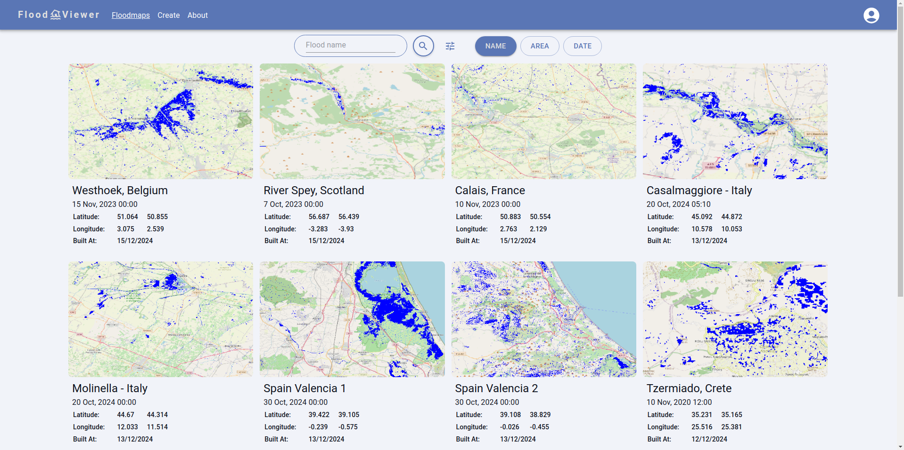

# FloodViewer

This web app simplifies the process of mapping floods using [SAR](https://en.wikipedia.org/wiki/Synthetic-aperture_radar) images from [Sentinel-1](https://www.esa.int/Applications/Observing_the_Earth/Copernicus/Sentinel-1).
It allows users to create new flood maps by selecting an area of interest on an interactive map and specifying the date of the flood.

The maps are generated in the backend by running [FLOODPY](https://github.com/kleok/FLOODPY), and the results are stored in a GeoServer instance.
Users can also view flood maps created by others as well as sign up for a more personalized experience.



## Technologies  

### Frontend  
- **React**: Simplifies the implementation of the user interface.  
- **React-Router**: Manages and the navigation between pages an handles data fetching and form submissions.
- **MUI**: Provides nice UI components.
- **Leaflet**: Embeds interactive maps.
- **Rollup**: Creates optimized builds.
- **Vite**: Simplifies development.
- **Yup**: Validates forms.
- **React Testing Library**: Allows testing of React components.

### Backend  
- **FLOODPY**: Downloads and processes SAR images to generate flood maps.
- **GeoServer**: Stores and serves the products of FLOODPY.
- **Django**: Implements backend logic, API endpoints, and user authentication.
- **SimpleJWT**: Implements JWT-based authentication.
- **Celery**: Executes FLOODPY asynchronously as a separate process.
- **Channels**: Provides WebSocket support for real-time updates on FLOODPY task progress.
- **Redis**: Acts as a task queue for FLOODPY execution and caches data for faster responses.
- **PostgreSQL**: Primary DB for storing user data and flood map metadata.


### Deployment  
- **Docker Compose**: Simplifies setup and installation with containers.  

## Installation  

To set up the app locally, follow these steps:  

1. **Clone the Repository**:  
   ```bash  
   git clone https://github.com/adamsigi/FloodViewer.git
   cd FloodViewer
   ```

2. **Configure Environment Variables**: 
    Define the necessary variables in the `/backend/.env` file.

3. **Run with Docker**:
    - Ensure Docker and Docker Compose are installed.
    - Build and start the app:
    ```bash  
    docker compose -p floodviewer -f docker/docker-compose.dev.yml up --build
    ```
4. **Testing**:
    - Stop the app.
    - Run frontend tests:
    ```bash  
    docker compose -p floodviewer -f docker/docker-compose.dev.yml run frontend npm run test
    ```
    - Run backend tests:
    ```bash  
    docker compose -p floodviewer -f docker/docker-compose.dev.yml run backend conda run --no-capture-output -n floodpy_gpu python manage.py test
    ```

## Disclaimer
This app comes with NO WARRANTIES OF CORRECTNESS and is primarily intended for research purposes.
